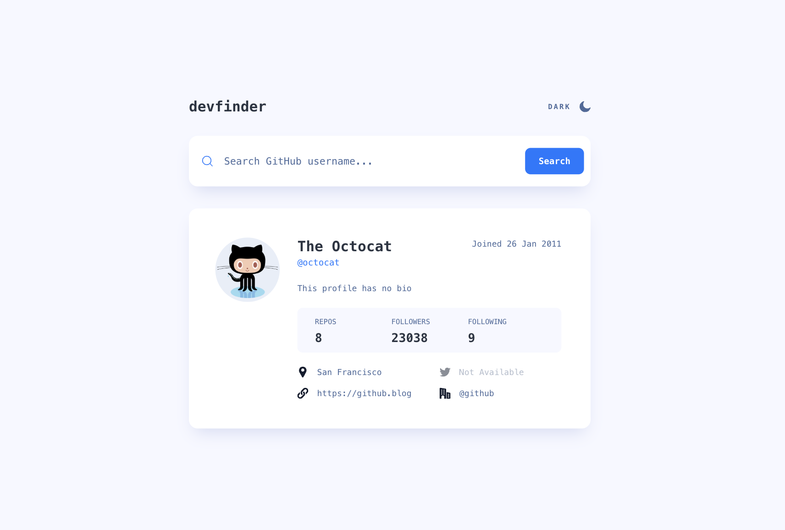

# Github User Search App

## Table of contents

- [Overview](#overview)
  - [Screenshot](#screenshot)
  - [Links](#links)
- [My process](#my-process)
  - [Built with](#built-with)
- [Author](#author)

## Overview

### Screenshot

### Links

- Solution URL: [Solution URL](https://github.com/kisu-seo/github_user_search_app)
- Live Site URL: [Live URL](https://kisu-seo.github.io/github_user_search_app/)

## My process

### Built with

- **React 19** — Component-based UI split into a root `App` component composed of `Header`, `SearchForm`, `ErrorCard`, and `ProfileCard`, with custom hooks (`useTheme`, `useGithubUser`) encapsulating theme persistence and GitHub API state.
- **GitHub REST API** — Fetches live user data from `https://api.github.com/users/:username` using the native `fetch` API, with loading and error states driving the UI.
- **Tailwind CSS 4** — Handles all styling via utility classes with a CSS-first `@theme` design token system (colors, border radius, spacing, typography presets) and `@utility` classes, plus responsive breakpoints for mobile, tablet, and desktop layouts.
- **Vite 8** — Serves as the frontend build tool, offering a fast development server (HMR) and an optimized production build via `@vitejs/plugin-react`.
- **ESLint** — Flat-config setup with `eslint-plugin-react-hooks` and `eslint-plugin-react-refresh` to enforce React Hooks rules and catch issues during development.
- **Light/Dark Theme Toggle** — Detects the OS `prefers-color-scheme` on first load, persists the user's choice in `localStorage`, and switches themes via a `dark` class on `<html>`.
- **Semantic HTML5 & Accessibility (A11y)** — Built with semantic tags (`<main>`, `<section>`, `<header>`, `<form>`), ARIA attributes (`aria-label`, `aria-hidden`, `role="alert"`), and keyboard-accessible, focus-visible interactive controls throughout.

## Author

- Website - [Kisu Seo](https://github.com/kisu-seo)
- Frontend Mentor - [@kisu-seo](https://www.frontendmentor.io/profile/kisu-seo)
